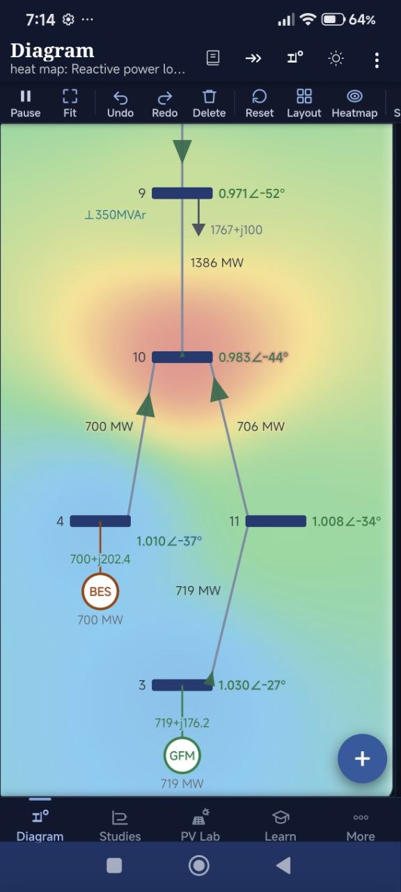
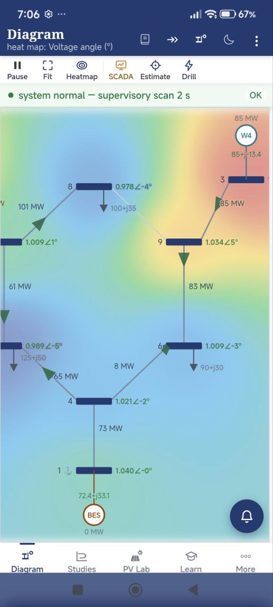
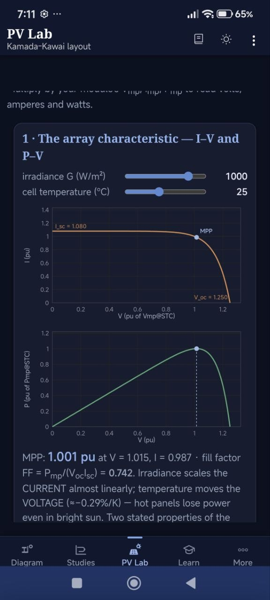

# PSDAT Mobile

The Android companion app to the PSDAT toolbox and the textbook — the same engine,
running on your phone, fully offline.

  
  
  

## What it does

- **Diagram** — build and edit a single-line diagram by touch: buses, lines,
  transformers, machines, PV, wind, storage, FACTS devices. Power flow re-solves as
  you edit, with a heat map over any selected variable (voltage magnitude or angle,
  reactive loss, loading) and animated flow arrows.
- **Studies** — transient stability, small-signal and modal analysis, frequency and
  voltage studies, run on-device.
- **PV Lab** — an interactive photovoltaic laboratory: I–V and P–V characteristics,
  irradiance and temperature sweeps, partial shading with bypass diodes, reserve and
  IEEE 1547-style grid-support curves.
- **Learn** — a guided theory section that mirrors the book.
- **SCADA** — a supervisory mode with a live scan, state estimation and drill-down.
- **Night and day themes**, and it works with no network connection once installed.

## Getting the app

The app is **completely free** and is currently in **closed testing** on Google Play.

1. Use an Android phone or tablet.
2. [Add your email using this short form](https://forms.gle/EuKSDUdEcQuDzB5L8) — enter
   the Google (Gmail) account you use on your Android device. Your email stays private;
   only the author sees it.
3. Once you have been added, open the app on Google Play and install it.

**[✉️ Add your email to join](https://forms.gle/EuKSDUdEcQuDzB5L8)**

Already added?
**[Open PSDAT on Google Play →](https://play.google.com/store/apps/details?id=com.psdat.mobile)**

Because it is a closed test, only approved testers can install it. You will get access
shortly after being added.

## Source

The app's engine source is not published here while the closed test is running.
The identical models and algorithms are available and fully readable in the
[`python/`](../python/) and [`matlab/`](../matlab/) implementations — that is the
point of the project: nothing in the app does anything the open source does not.
